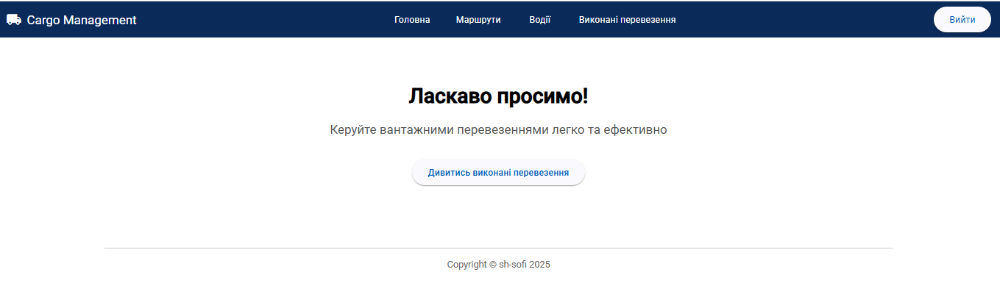
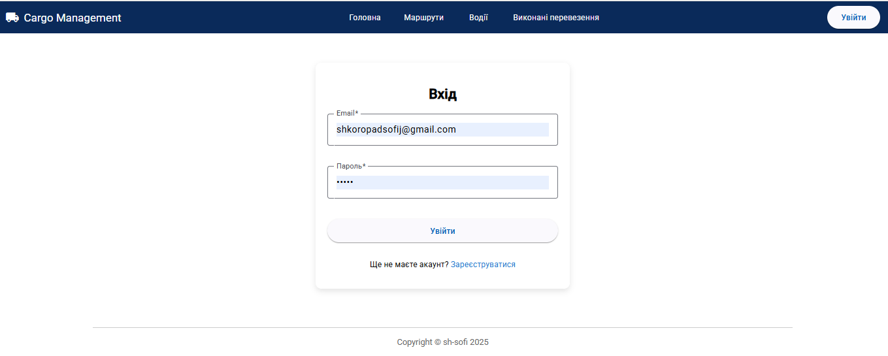
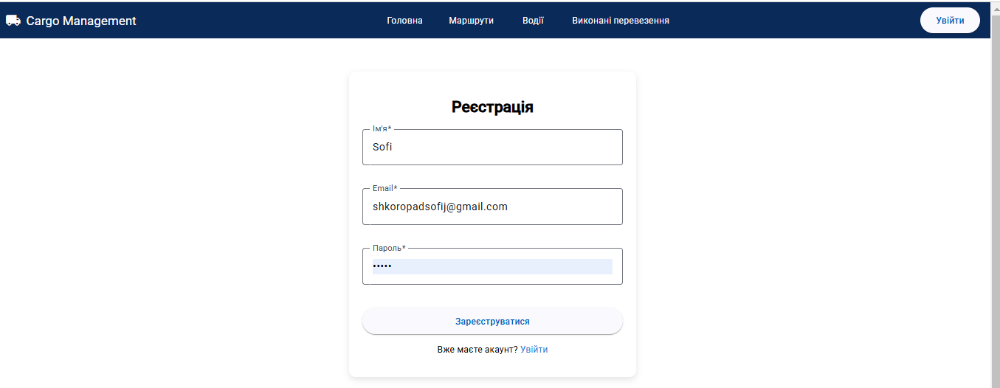
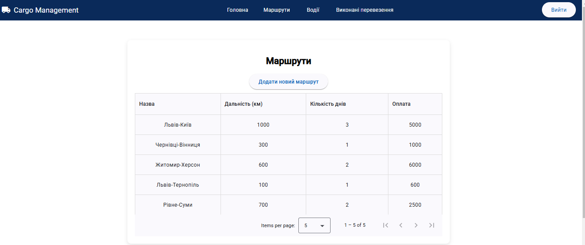
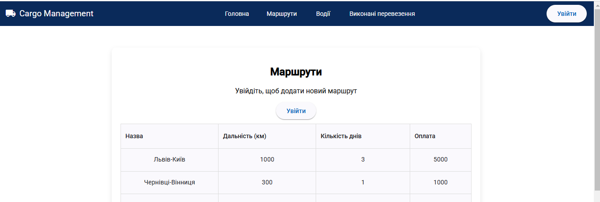
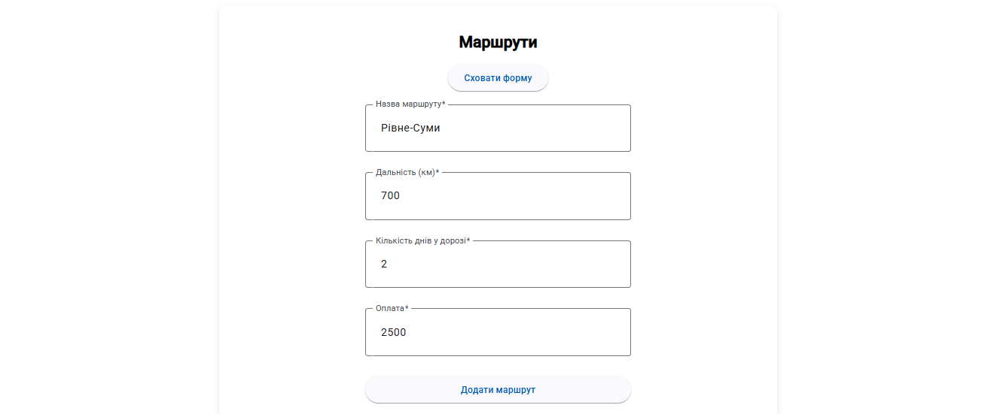

# Cargo Management

Cargo Management is a web application built with Angular and Angular Material. It serves as the user interface for managing cargo transportation, providing authentication and CRUD operations for routes, drivers, and completed transportations.

## Table of Contents

- [Features](#features)
- [Instruction](#instruction)
- [Usage](#usage)
- [Demo](#demo)
- [Technologies Used](#technologies-used)
- [Contributing](#contributing)
- [License](#license)

## Features

- **Authentication & Authorization**: Implemented login and registration functionality.
- **Navigation Panel**: Accessible menu for managing different sections.
- **Home Page**: Welcome message with a call-to-action to explore completed transportation.
- **Drivers Page**: Includes form for adding new drivers and list of existing drivers in db.
- **Routes Page**: Includes form for adding new routes and list of existing routes in db.
- **Completed Work Page**: Includes form for adding new completed works and list of existing completed works in db.
- **Responsive Design**: Optimized for various screen sizes. Built with Angular Material.

## Instruction

This frontend interacts with the Cargo Management API. Ensure the backend is running and correctly configured in the environment settings.
https://github.com/sh-sofi/cargo-management-backend.git

1. Clone this repository:

   ```bash
   git clone https://github.com/sh-sofi/cargo-management-frontend.git
   cd cargo-management-frontend
   ```

2. Install dependencies:

   ```bash
   npm install
   ```

3. Start the application:
   ```bash
   ng serve
   ```

## Usage

Open the app in your browser at http://localhost:4200.

Navigate through the pages: Home, Routes, Drivers, and Completed Works.

Use authentication features (e.g., Login) for restricted pages.

## Demo








## Technologies Used

- **Front-end Framework**: Angular
- **UI Library**: Angular Material
- **State Management**: Services and Observables
- **API Communication**: HTTP Client
- **Routing**: Angular Router

## Contributing

This is a learning project, so contributions are not expected. However, feel free to fork and experiment with it. For suggestions or feedback, please open an issue.

## License

This project is licensed under the MIT License. See the LICENSE file for details.

##

Repository created during the course by TechMagic Academy "JavaScript Course".

Special thanks to the course instructor for guidance and learning materials. 🙌
